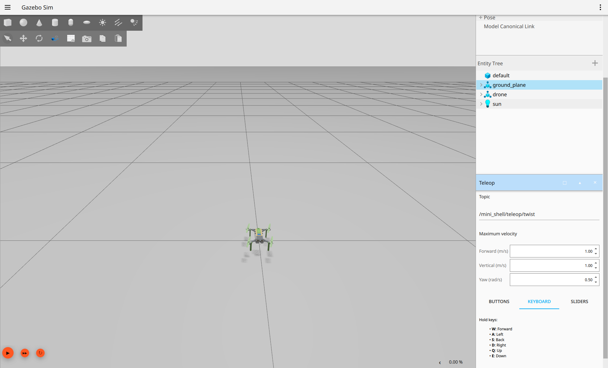
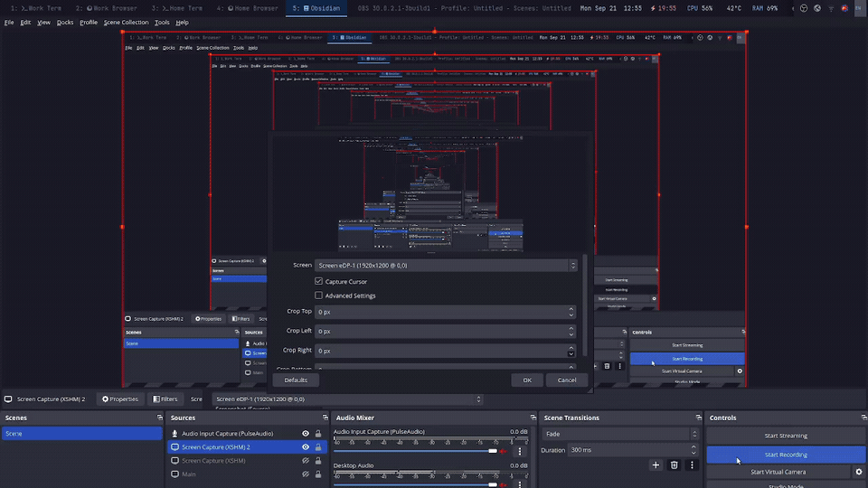

# Basic drone simulation: Gazebo and Foxglove

## Purpose

Start with one OnShape-derived drone in an otherwise empty world with a
ground plane and light. Fly it using Gazebo's GUI teleop controls and watch
the same motion in Foxglove. This is the first end-to-end example before
adding sensors, autonomy, or hardware in the loop (HIL).

The SDF supplies Gazebo's geometry, collisions, mass, inertia, joints, and
simulation plugins. The matching URDF supplies Foxglove's visual model and
link structure. Both must represent the same CAD assembly and use consistent
units, link names, and coordinate frames.

## Launch behavior

The mini-shell launch now:

1. Opens Gazebo with the drone included in the basic world.
2. Starts the flight controller and the Gazebo GUI teleop panel.
3. Starts the ROS–Gazebo bridge for commands, simulation time, and state.
4. Publishes the URDF and the transforms needed to position its links.
5. Starts the Foxglove bridge and opens the installed Foxglove desktop app
   with a connection to `ws://localhost:8765`.

Import the saved Foxglove layout once using the instructions below.

Gazebo runs the physics; Foxglove displays the resulting state using the
URDF. Loading an SDF in Gazebo does not automatically publish a URDF or
make the drone move in Foxglove.

```text
Gazebo GUI teleop → ROS–Gazebo bridge → teleop mapping
    → ROS–Gazebo bridge → flight controller → motors → simulated motion

Gazebo pose, joint state, and clock → ROS–Gazebo bridge
    → ROS transforms + URDF → Foxglove bridge → Foxglove 3D panel
```

The visualization needs a world-to-body transform from the simulated pose,
plus link transforms from `robot_state_publisher`; moving joints need joint
states. ROS nodes using simulation time must receive `/clock`.

## What works today

As checked on September 21, 2026, the project builds with ROS 2 Jazzy and
Gazebo Harmonic, and the mini-shell launch accepts commands through the
ROS–Gazebo bridge and produces upward motion. The integration test checks
that the URDF, clock, joint states, and all five link transforms are
available and that the body transform follows Gazebo odometry during flight.

From the repository root, build and start the example:

```bash
source /opt/ros/jazzy/setup.bash
colcon build --base-paths f_drone_simulation
source install/setup.bash
ros2 launch f_drone_bringup mini_shell_launch.launch.py
```

Relevant files:

- [Launch file](../f_drone_bringup/launch/mini_shell_launch.launch.py)
- [Basic world](../f_drone_gazebo/worlds/mini_shell.sdf)
- [Simulation model](../f_drone_description/models/mini_shell/model_teleop.sdf)
- [Visualization model](../f_drone_description/models/mini_shell/model.urdf)
- [Bridge configuration](../f_drone_bringup/config/mini_shell_bridge.yaml)

## Foxglove setup and TF

In Foxglove's layout menu, import
[mini_shell_gazebo_viewer.json](../f_drone_bringup/config/mini_shell_gazebo_viewer.json).
This is the Foxglove layout; `mini_shell_gui.config` configures Gazebo's GUI
and cannot be imported as a Foxglove layout.

The layout reads `/robot_description` and uses TF to place the model's
links, with `base_link` as the camera-follow frame. Meshes are fetched from
the sourced description package through the bridge, so the layout does not
need a machine-specific URDF path. A file-based URDF layer is also valid,
but selecting transform control still requires the matching TF stream.

```text
world                         Gazebo's simulated pose, bridged to /tf
└── base_link
    ├── prop                  robot_state_publisher, from /joint_states
    ├── prop_2
    ├── prop_3
    └── prop_4
```

| ROS topic | Purpose |
| --- | --- |
| `/robot_description` | URDF published by `robot_state_publisher`, retained for late connections |
| `/joint_states` | Actual Gazebo rotor angles and velocities |
| `/tf` | World-to-body pose and body-to-propeller transforms |
| `/clock` | Gazebo simulation time |
| `/mini_shell/odometry` | Simulated body pose and velocity for comparison and plotting |

The URDF has four movable joints and no fixed joints, so no fixed-link
transforms are expected on `/tf_static`. Each transform has one owner:
Gazebo publishes `world → base_link`, and `robot_state_publisher` publishes
the four propeller transforms. The base link and SDF model origin coincide.

For an already-open Foxglove client, append `foxglove_gui:=false` to the
launch command and connect to `ws://localhost:8765` manually. The bridge
still runs. Use `gazebo_gui:=false` for server-only Gazebo, or
`foxglove_port:=8877` if another bridge already uses port 8765. The bridge
binds to localhost for this same-machine example.

Useful checks, in another terminal with ROS and the workspace sourced:

```bash
ros2 topic echo /joint_states --once
ros2 run tf2_ros tf2_echo world base_link
ros2 run tf2_ros tf2_echo base_link prop
```

Stop each continuous TF check with Ctrl+C before running the next command.
The integration regression runs with `colcon test --packages-select
f_drone_bringup`, followed by `colcon test-result --verbose`; on this machine,
prefix the test command with `CTEST_COMMAND=/usr/bin/ctest` to bypass the
obsolete local CTest wrapper.

See [Robot State Publisher](https://github.com/ros/robot_state_publisher/tree/jazzy)
and the [Foxglove 3D documentation](https://docs.foxglove.dev/docs/visualization/panels/3d)
for the underlying URDF and transform behavior. The existing KDL warning
about root-link inertia does not prevent visualization; Gazebo continues
to use the SDF inertial properties for physics.

## Controls

The existing mapping uses W/S for forward/backward, Q/E for up/down, and
A/D for left/right. These request velocity; the flight controller produces
the attitude changes and motor thrust needed to move the drone.

The current mapping converts the teleop panel's yaw input into lateral
motion, so **independent yaw control is still needed** to cover translation
and heading together. This example does not provide direct manual throttle,
roll, or pitch commands to dRehmFlight; that belongs to the later HIL stage.

## Recorded demonstration

On September 21, 2026, the operator reported successful manual checks of
roll, pitch, yaw, and throttle response in Gazebo and supplied the following
screenshot and recording. The exact yaw input used for that check still
needs documenting because the launch mapping above repurposes yaw as
lateral motion.



The animation shows the full recording at 12 frames per second, scaled to
960 pixels wide for viewing in this document.



[Download the original video with audio (MKV)](visuals/mini_shell_teleop_controls.mkv).

This recording predates the Foxglove integration and documents Gazebo only;
world-reset behavior and a matching Foxglove demonstration remain separate
checks.

## Completion checks

- One launch opens both applications and starts the required bridges and
  publishers, without manual topic wiring.
- The drone's meshes and link placement render correctly in both viewers.
- The drone rests on the ground without falling through it or moving
  unexpectedly; mass, inertia, and collisions are checked against the CAD
  assembly and available physical measurements.
- Small commands produce the expected vertical, forward/backward, lateral,
  and yaw response; stopping commands stops the requested motion.
- Foxglove follows Gazebo's position, orientation, and relevant joint motion
  with consistent simulation timestamps.
- A full world reset restores exactly one drone to its starting state,
  clears prior commands, and leaves teleop and visualization usable.
- If respawning a deleted drone is required, deletion followed by reset is
  tested explicitly rather than assuming pose reset recreates the entity.

Record each issue with the model/version, launch command, input, expected
behavior, observed behavior, and relevant logs or screenshots. A successful
import or short climb alone does not establish physical fidelity or a
validated flight envelope.
